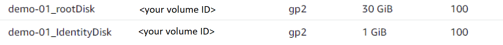

# Provisioned VM
## Overview
A provisioned VM is a VM(Virtual Machine) created on the Hypervisor. In AWS, VMs are EC2 Instances. 

## How to use Provisioned VM
### Creating Prov VM
Before we create the VM, we first need to create the AD Accounts. To create AD Accounts, use `New-AcctADAccount`
```powershell
$adUsername = "demo-username"
$secureUserInput = Read-Host 'Please enter your AD password' -AsSecureString
$encryptedInput = ConvertFrom-SecureString -SecureString $secureUserInput
$adPassword = ConvertTo-SecureString -String $encryptedInput

$identityPoolName = "demo-identitypool"
$numberOfVms = 5

$adAccounts = New-AcctADAccount -Count $numberOfVms -IdentityPoolName $identityPoolName -ADUserName $adUsername -ADPassword $adPassword
```
[New-AcctADAccount Documentation](https://developer-docs.citrix.com/en-us/citrix-virtual-apps-desktops-sdk/current-release/adidentity/new-acctadaccount)

After creating the AD Accounts, create the provisioned VMs using `New-ProvVM`
```powershell
$provisioningSchemeName = "demo-provScheme"
$newProvVmResult = New-ProvVM -ProvisioningSchemeName $provisioningSchemeName -ADAccountName $adAccounts.SuccessfulAccounts.ADAccountName
```
[New-ProvVM Documentation](https://developer-docs.citrix.com/en-us/citrix-virtual-apps-desktops-sdk/current-release/machinecreation/new-provvm)


Finally, create the Broker Machines using `New-BrokerMachine`

```powershell
# Using the value we get from New-ProvVM previously, get only the AD Accout SID
$newProvVMSids = @($newProvVmResult.CreatedVirtualMachines | Select-Object ADAccountSid)

# Get the catalog UID
$brokerCatalogs = Get-BrokerCatalog -Name $provisioningSchemeName

$newBrokerMachines = $newProvVMSids | ForEach-Object { New-BrokerMachine -CatalogUid $brokerCatalogs[0].Uid -MachineName $_.ADAccountSid }
```

[New-BrokerMachine Documentation](https://developer-docs.citrix.com/en-us/citrix-virtual-apps-desktops-sdk/current-release/Broker/New-BrokerMachine.html)

After creating a Provisioned VM, there will be two disk attached to it:



### Getting Prov VM
To get a specific Provisioned VM, use the `VMName` parameter in `Get-ProvVM`
```powershell
$provisioningSchemeName = "demo-provScheme"
$VMName = "demo-provVM"

Get-ProvVM -VMName $VMName
```

To get a list of VMs that were provisioned using a specific Prov Scheme, use the `ProvisioingSchemeName` parameter.
```powershell
$provisioningSchemeName = "demo-provScheme"
Get-ProvVM -ProvisioningSchemeName $provisioningSchemeName
```

You can get a filtered list of Catalogs using `Filter`. The list can be sorted by using `SortBy`. <br>
[More Info about Filter and SortBy](https://developer-docs.citrix.com/en-us/citrix-virtual-apps-desktops-sdk/current-release/machinecreation/about_prov_filtering)
```powershell
$filter = "{Domain -eq 'demo.local'}"
$sortBy = "-CpuCount"

Get-ProvVM -Filter $filter -SortBy $sortBy
```

**Note**: if no parameter is provided, then the script will return all the provisioned VMs

[Get-ProvVM Documentation](https://developer-docs.citrix.com/en-us/citrix-virtual-apps-desktops-sdk/current-release/machinecreation/get-provvm)

### Deleting Prov VM
Before you remove a Prov VM, first you need to remove the Broker Machine, use `Remove-BrokerMachine` and pass in the catalog name
```powershell
$machineName = "DOMAIN\demo-provVM1"

Remove-BrokerMachine -MachineName $machineName
```
[Remove-BrokerMachine Documentation](https://developer-docs.citrix.com/en-us/citrix-virtual-apps-desktops-sdk/current-release/broker/remove-brokermachine)

Then remove the Prov VM using `Remove-ProvVM`.
```powershell
$provisioningSchemeName = "demo-provScheme"
$VMName = "demo-provVM1"

Remove-ProvVM -ProvisioningSchemeName $provisioningSchemeName -VMName $VMName
```
You can also pass in the optional parameter `ForgetVM`. If this parameter is specified, this command will remove the provisioned VM's data from the Citrix site database and also delete Citrix-assigned identifiers(like tags or custom-attributes) on the VMs and the VMs' resources from hypervisor. The VMs and VMs' resources will still remain in the hypervisor.
```powershell
Remove-ProvVM -ProvisioningSchemeName $provisioningSchemeName -VMName $VMName -ForgetVM
```

There is also another optional parameter `PurgeDBOnly`. If this option is specified, this command will only remove VM objects from the Machine Creation Services database; however, the VMs and hard disk copies still remain in the hypervisor. This cannot be used with `ForgetVM`
```powershell
Remove-ProvVM -ProvisioningSchemeName $provisioningSchemeName -VMName $VMName -PurgeDBOnly
```
**Note**: This will not remove the Citrix-assigned identifiers(like tags or custom-attributes).

[Remove-ProvVM Documentation](https://developer-docs.citrix.com/en-us/citrix-virtual-apps-desktops-sdk/current-release/machinecreation/remove-provvm)

While this is optional, but remove the AD accounts of the VMs
```powershell
$identityPoolName = "demo-identitypool"
# Get the all the AD Accounts SID of the prov vms you want to delete
$provVM = Get-ProvVM -ProvisioningSchemeName $provisioningSchemeName -VMName $VMName
$adAccountSids = $provVM | Select-Object -ExpandProperty ADAccountSid

Remove-AcctADAccount -IdentityPoolName $identityPoolName -ADAccountSid $adAccountSids
```
We recommend deleting the AD Accounts, unless you plan on using them, i.e. create another Provisioned VM.<br>
[Remove-AcctADAccount Documentation](https://developer-docs.citrix.com/en-us/citrix-virtual-apps-desktops-sdk/current-release/adidentity/remove-acctadaccount)