# AWS Citrix MCS PowerShell Samples

## Overview

Scripts in this folder are tailored to AWS and its unique features. As mentioned in the [MCS README](../README.md), there are 5 major building blocks to consider.
- **Hosting Connection**
	- To learn more about AWS connections, see https://docs.citrix.com/en-us/citrix-virtual-apps-desktops/install-configure/connections/connection-aws
- **Hosting Unit**
	- An AWS hosting unit must specify an availability zone. This is where your MCS resources will be provisioned.
	- An AWS hosting unit must specify at least one network. This is the network that your provisioned VMs will use.
- **Identity**
- **ProvScheme**
	- AWS ProvSchemes supports a variety of Custom Properties, which can be used to customize your configuration.
	- To learn more about AWS ProvSchemes, see https://docs.citrix.com/en-us/citrix-daas/install-configure/machine-catalogs-create/create-machine-catalog-aws
- **ProvVM**

Note: Unless otherwise specified, these scripts are written with Citrix DaaS in mind. To tailor the scripts to CVAD, you should provide the -AdminAddress parameter. For more information, please refer to: https://developer-docs.citrix.com/en-us/citrix-virtual-apps-desktops-sdk/current-release 

## Features
This repository contains examples of several AWS & MCS features. Note that this is not an exhaustive list; there are many AWS & MCS features that are not listed here. The features listed below are those that currently have examples in this repository:
- [Machine Profile](ProvScheme/MachineProfile)
- [Reset Disk](ProvVM/Reset%20Disk/)
- [Image Management](Image%20Management/)

## Sample Admin Scenario Scripts
This repository contains common scripts for admins:

### CreateHostingResources
[CreateHostingResources.ps1](SampleAdminScenarios/CreateHostingResources.ps1)
This script is similar to the "Add Connection and Resources". It creates the Hosting Connection and Hosting Unit.<br>
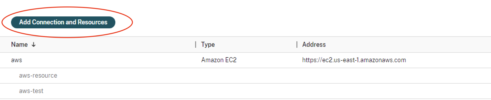

### Image Management
[CreateImageVersion.ps1](SampleAdminScenarios/CreateImageVersion.ps1)
This script creates a Provisioned Image Definition Connection and craetes an Image Version to Create Catalog.<br>
This script is similar to the "Images" menu from the DaaS management console. It creates Image Definitions and Image Versions.<br>
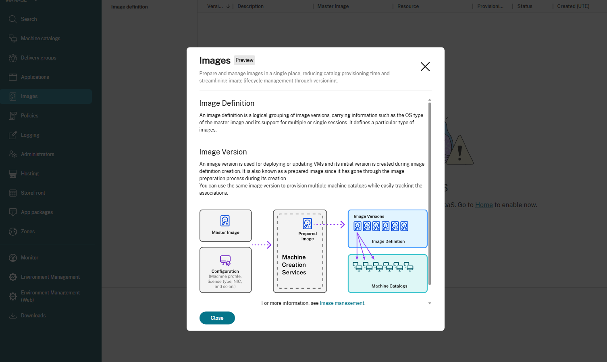

### Create Catalog
[CreateCatalog.ps1](SampleAdminScenarios/CreateCatalog.ps1)
This script is similar to the "Create Machine Catalog" button in Citrix Studio. It creates the identity pool, ProvScheme, Broker Catalog, AD Accounts, and ProvVms.<br>
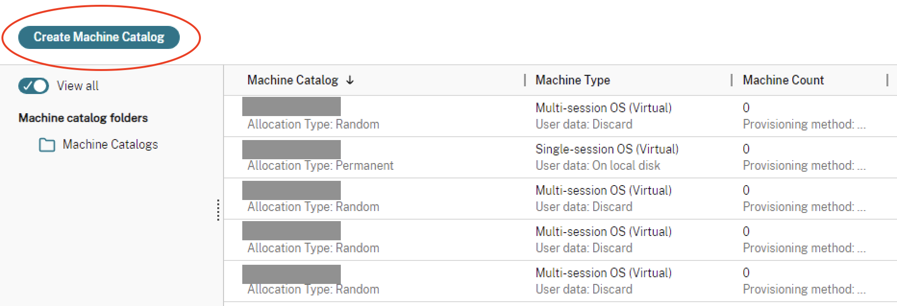

### Remove Catalog
[RemoveCatalog.ps1](SampleAdminScenarios/RemoveCatalog.ps1)
This script is similar to the "Delete Machine Catalog" button in Citrix Studio. It removes the identity pool, ProvScheme, Broker Catalog, AD Accounts, and ProvVMs.<br>
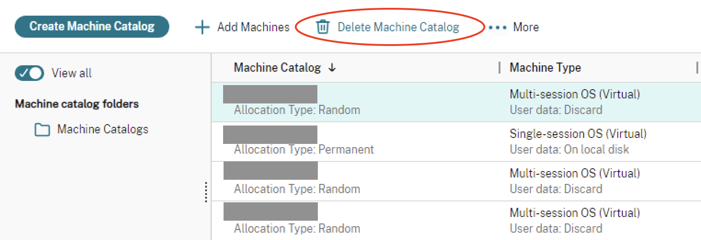

## AWS Environment Setup & Considerations
Make sure you set up your AWS account as a resource location and have the necessary resources. Checkout [AWS Cloud environment](https://docs.citrix.com/en-us/citrix-virtual-apps-desktops/install-configure/install-prepare/aws) for more information.

### <a name="zone"></a> Zone
Using zones, you can group items in your site to streamline and improve your network performance. A zone can include items in a geographic location, or it can be another grouping type for your unique deployment.

#### Studio UI

From the Citrix Console, go to XAXD service profile<br>
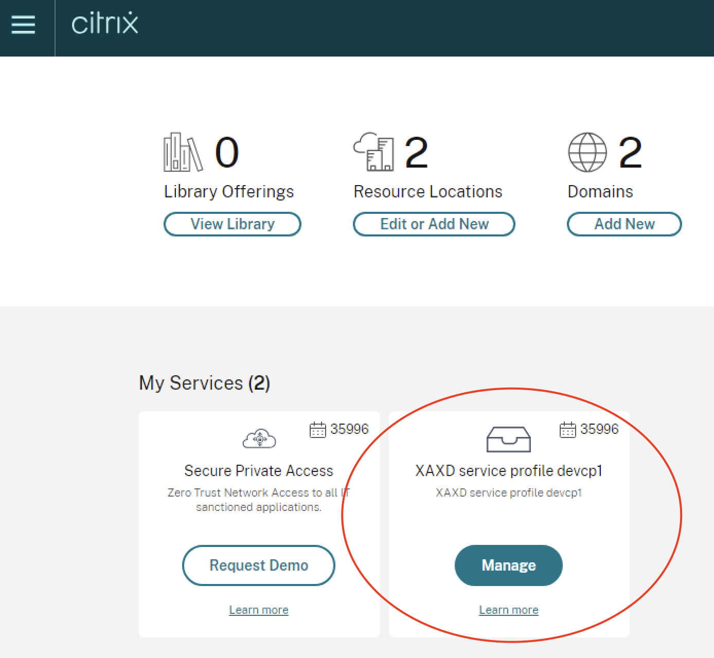

Then on the navigation side bar, go to **Zones**<br>
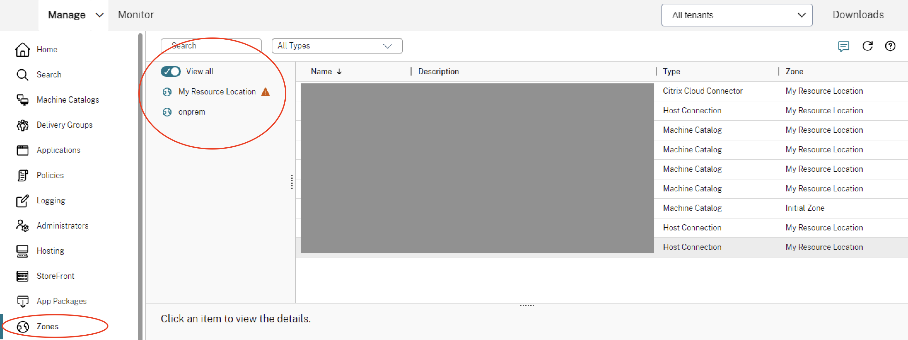

You should see the list of Zones.<br>
**Note**: You cannot get the Zone Uid from here.

#### Powershell

Use the powershell command `Get-ConfigZone`
```powershell
# If you know the name, you can use the name parameter to get directly the Zone UID
$configZone = Get-ConfigZone -Name "demo-zone"
$configZoneUid = $configZone.Uid
# If you don't know the name of the zone, you can Get-ConfigZone and look through all the zones to find the one you want to use
Get-ConfigZone
```

There are other parameters you can use to filter the list of Config Zones if you don't know the name. <br>[More info about Get-ConfigZone](https://developer-docs.citrix.com/en-us/citrix-virtual-apps-desktops-sdk/current-release/CentralConfig/Get-ConfigZone.html)

To create a Config Zone/Resource Location, refer to https://docs.citrix.com/en-us/citrix-daas/install-configure/resource-location/aws-host

### <a name="api-key"></a> API Key

An API key is an alphanumeric string that API developers use to control access to their APIs.

To view and get the API Key<br>
1. Open the Amazon API Gateway console at https://console.aws.amazon.com/apigateway/
2. In the left navigation pane, choose **API Keys** <br>
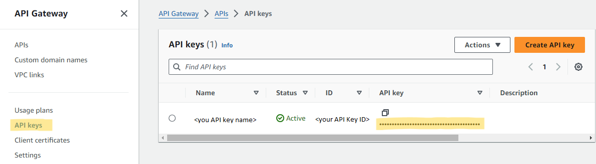

**Note**: You can only get the secret key when you first create the API key. You cannot later access the secret key, so either ask an Admin for the secret key if needed.

To learn more about Api keys, refer to the following AWS docs
- https://aws.amazon.com/what-is/api-key/
- https://docs.aws.amazon.com/IAM/latest/UserGuide/id_credentials_access-keys.html

You could also use role based authentication using `role_based_auth` as the secret and API key instead. For more info on role based authentication, checkout this [Citrix Blog](https://www.citrix.com/blogs/2019/02/04/role-based-authentication-for-citrix-virtual-apps-and-desktops-in-aws/) for more information.

### <a name="vpc"></a> VPC

Amazon Virtual Private Cloud (Amazon VPC) enables you to launch AWS resources into a virtual network that you've defined.

To view and get the VPC ID<br>
1. Open the Amazon VPC console at https://console.aws.amazon.com/vpc/
2. In the left navigation pane, choose **Your VPCs**.<br>
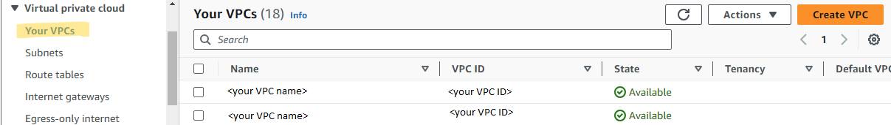

To learn more about VPC, checkout [AWS VPC Documentation](https://docs.aws.amazon.com/vpc/latest/userguide/what-is-amazon-vpc.html)

### <a name="network"></a> Network

To view and get the network<br>
1. Open the Amazon VPC console at https://console.aws.amazon.com/vpc/
2. In the left navigation pane, choose **Subnets**.<br>
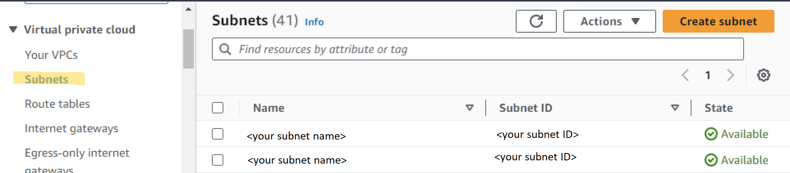

3. Select the subnet you want to use.
4. Under **IPv4 CIDR** is the IP Address you will use.<br>
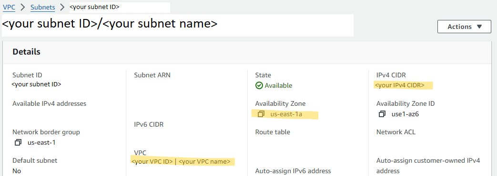

To construct a network path replace the correct value in the parts in quotations:<br>
- XDHyp:\Connections\\"insert connection name"\\"VPC name".virtualprivatecloud\\"availability zone".availabilityzone\\"ip address"``/"CIDR" ("VPC id").network

For example, a Network Path would look something like this: 
- XDHyp:\Connections\demo-connection\apollo-VPC.virtualprivatecloud\us-east-1a.availabilityzone\0.0.0.0``/0 (vpc-12345678910).network

### <a name="security-group"></a> Security Group

To view and get the security groups
1. Open the Amazon EC2 console at https://console.aws.amazon.com/ec2/
2. In the left navigation pane, choose **Security Groups**.<br>
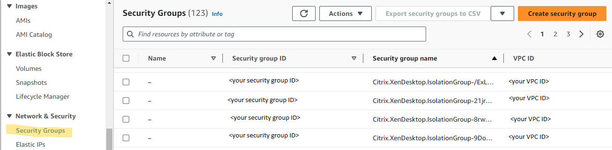