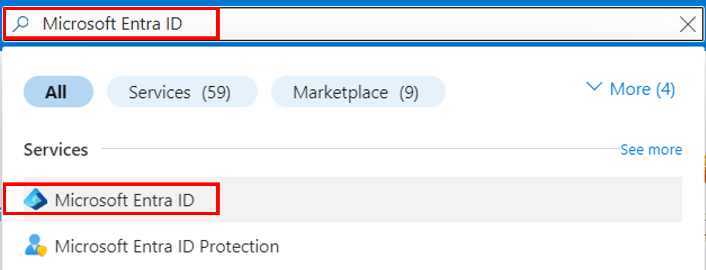
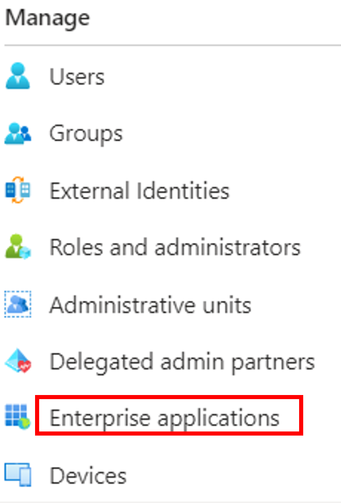
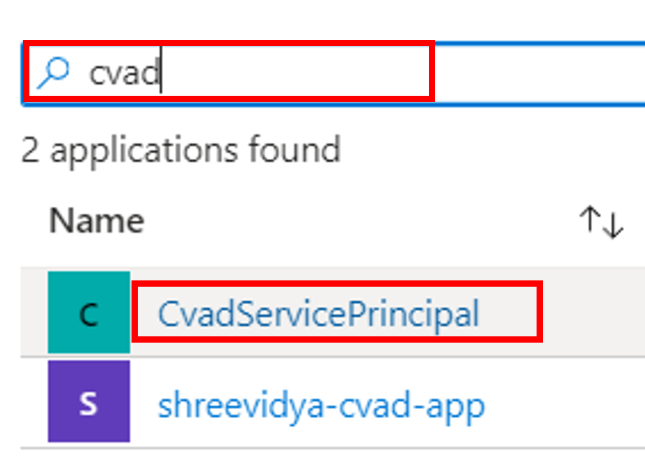
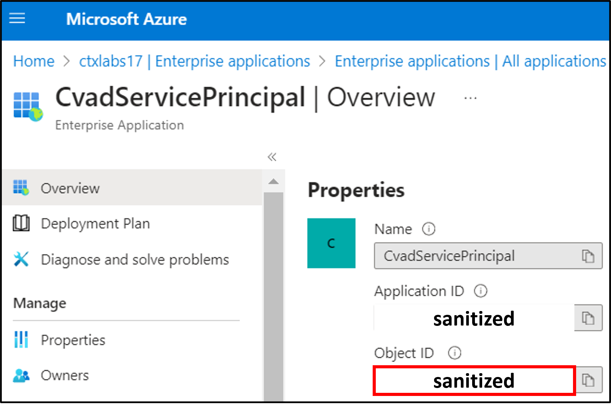
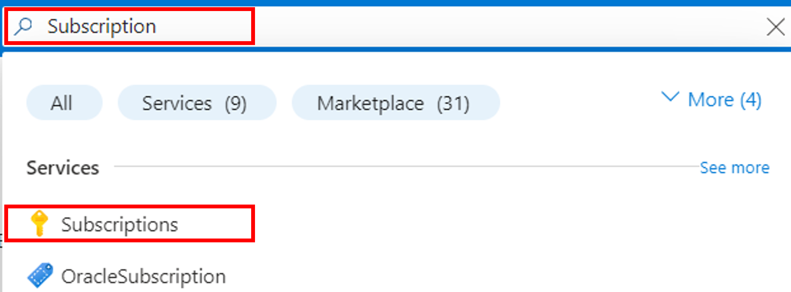
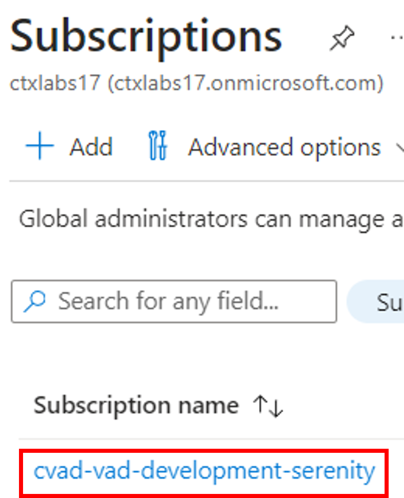
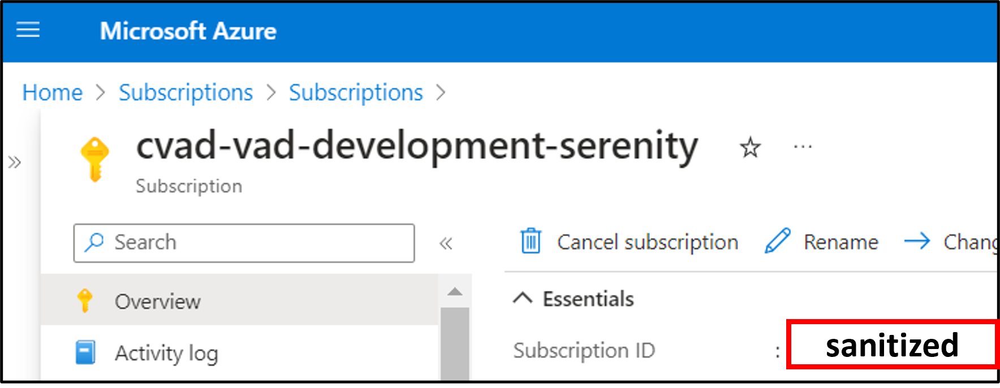
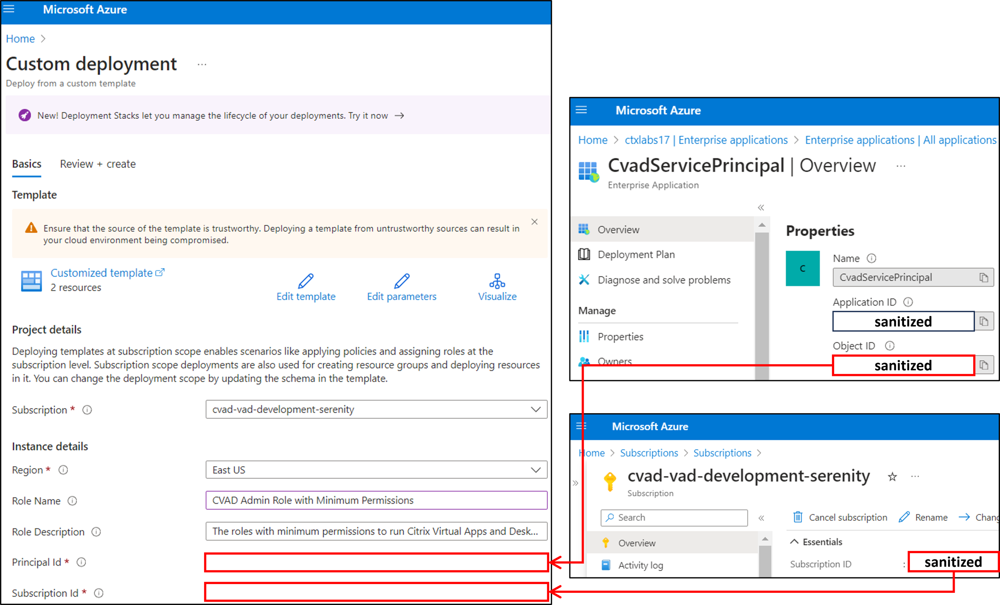

# ARM Template for CVAD Operations

This document introduces an Azure Resource Manager (ARM) template designed to automate the creation and assignment of a custom Azure role for Citrix Virtual Apps and Desktops (CVAD). This role is specifically tailored with minimal permissions necessary for managing CVAD operations, addressing security concerns by limiting permissions to the essentials.

<br> 

## 1. Context and Problem

Currently, CVAD operations on Azure, such as creating hosting connections or machine catalogs, utilize the Contributor role of Azure. 

1. The Contributor role grants more permissions than necessary, raising concerns for customers who prefer minimal permissions for security reasons.
2. Replacing the role involves a manual process of investigating and setting up the appropriate permissions, creating a new role, and then assigning it, which is time-consuming and inconvenient for customers.

<br> 

## 2. Solution: CVAD ARM Template

The CVAD ARM template is a JSON file used to define the creation and assignment of Azure Roles with minimum permissions in a declarative manner for reducing security concerns. 

<br> 

### Key Features of the CVAD ARM Template

1. Automates the creation of an Azure Role with the necessary permissions for CVAD operations.
2. Automates the assignment of this role to a specified Azure Service Principal at the subscription level.

<br> 

### Prerequisites

Before using the CVAD ARM template, you need:

1. **Object ID of the Service Principal**: Identifies the service principal for role assignment.
2. **Application ID**: Identifies the Application for role assignment.
3. **Subscription ID**: Identifies the subscription under which the role is created and assigned.

<br> 

### Usage Notes

- **Azure Portal**: 
  1. When deploying through the Azure Portal, the **Object ID of the Service Principal** is required.
- **Azure PowerShell**: 
  1. When deploying through Azure PowerShell, the **Application ID** is necessary.
  2. For running the deployment PowerShell script, please ensure that **Azure PowerShell** is installed and that you open the PowerShell as an Administrator.
  3. The script will require you to sign in to the Azure environment and import the Azure Module.

<br> 

### Obtaining the Prerequisite IDs

- **For the Service Principal Object ID**:
  1. Navigate to **Microsoft Entra ID** on the Azure Portal.
  2. Select **Enterprise applications** and locate the service principal.
  3. Copy the **Object ID** (ensure it's the one from Enterprise applications, not the Application ID or the one under **App registrations**).
  
- **For the Subscription ID**:
  1. Navigate to **Subscription** on the Azure Portal.
  2. Select the target subscription and copy the **Subscription ID**.

<br> 

## 3. Deployment Instructions

The ARM template can be deployed using either the **Azure Portal** or **PowerShell**, providing flexibility based on user preference or specific automation needs.

### Via Azure Portal

Follow these steps to create and assign the custom role for CVAD using the ARM template through the Azure Portal.

#### Step 1: Obtain the Service Principal Object ID

1. Search for and click on Microsoft Entra ID.

<div align="center">
     
</div>

2. Click on Enterprise Applications in the left panel.

<br>

<div align="center">
     
</div>

3. Select the Service Principal name for role assignment.

<div align="center">
     
</div>

4. Copy the Object ID of the Service Principal.

<div align="center">
     
</div>

<br>

#### Step 2: Obtain the Subscription ID

1. Search for and click on Subscriptions.

<div align="center">
     
</div>

2. Click on the target Subscription name.

<div align="center">
     
</div>

3. Copy the Subscription ID.

<div align="center">
     
</div>


#### Step 3: Deploy the ARM Template

1. Click the "Deploy to Azure" button below to navigate to the Azure Custom Deployment page.

2. Enter the required details such as Subscription, Region, Service Principal Object ID, and Subscription ID.

The fields for Role Name and Role Description are pre-filled but can be modified.

<br>

<a href="https://portal.azure.com/#create/Microsoft.Template/uri/https%3A%2F%2Fraw.githubusercontent.com%2Fcitrix%2Fcitrix-mcs-sdk-samples%2Fmain%2FAzure%2FHosting%2520Connection%2FRole%2FRoleCreationAndAssignmentTemplate.json
" target="_blank">
    
</a>

<br>


The screenshot below illustrates the Azure Custom Deployment page, highlighting the sections where you can find and input the Service Principal ID and Subscription ID.

<br>

<div align="center">
     
</div>

<br> 

### Via PowerShell

The `RoleCreationAndAssignment.ps1` script facilitates the creation and assignment of a role with minimum permissions. It requires the following parameters:

    1. Location: The deployment location, for example, "centralus", "eastus", etc.
    
    2. TemplateFilePath: The file path of the Azure Resource Management (ARM) Template.
    
    3. SubscriptionId: The ID of the subscription where the new Azure Role is deployed.
    
    4. RoleName: The name of the new Azure Role.
    
    5. RoleDescription: A brief description of the role.
    
    6. ServicePrincipalObjectId: The object Id of the Service Principal.
    
    7. ApplicationId: The Application Id within Azure.

The RoleName and RoleDescription are optional. If not specified, default values will be used. 

To execute this script, either the ServicePrincipalObjectId or ApplicationId is required.

The script can be executed with parameters as shown in the example below:


```powershell
# Utilizing ServicePrincipalObjectId
.\RoleCreationAndAssignment.ps1 `
    -Location "eastus" `
    -TemplateFilePath ".\RoleCreationAndAssignmentTemplate.json" `
    -SubscriptionId "00000000-0000-0000-0000-000000000000" `
    -RoleName "CVAD Admin Role with Minimum Permissions" `
    -RoleDescription "The roles with minimum permissions to run Citrix Virtual Apps and Desktops (CVAD) operations on Azure" `
    -ServicePrincipalObjectId "11111111-1111-1111-1111-111111111111"

# Utilizing ApplicationId
.\RoleCreationAndAssignment.ps1 `
    -Location "eastus" `
    -TemplateFilePath ".\RoleCreationAndAssignmentTemplate.json" `
    -SubscriptionId "00000000-0000-0000-0000-000000000000" `
    -RoleName "CVAD Admin Role with Minimum Permissions" `
    -RoleDescription "The roles with minimum permissions to run Citrix Virtual Apps and Desktops (CVAD) operations on Azure" `
    -ApplicationId "11111111-1111-1111-1111-111111111111"
```

The parameters should be tailored to fit the specific target environment.

<br> 


## 4. Reference Documents

For comprehensive information and further reading, the following resources are recommended.

1. [CVAD SDK - Required Azure permissions](https://docs.citrix.com/en-us/citrix-daas/install-configure/connections/connection-azure-resource-manager.html#required-azure-permissions)
2. [Microsoft - Create or update Azure custom roles using an ARM template](https://learn.microsoft.com/en-us/azure/role-based-access-control/custom-roles-template)
3. [Microsoft - Device management permissions for Microsoft Entra custom roles](https://learn.microsoft.com/en-us/entra/identity/role-based-access-control/custom-device-permissions#full-list-of-permissions)
4. [Microsoft - Assign a role at subscription scope](https://learn.microsoft.com/en-us/samples/azure/azure-quickstart-templates/subscription-role-assignment/)
5. [Azure GitHub - Assign a role at subscription scope](https://github.com/Azure/azure-quickstart-templates/tree/master/subscription-deployments/subscription-role-assignment)