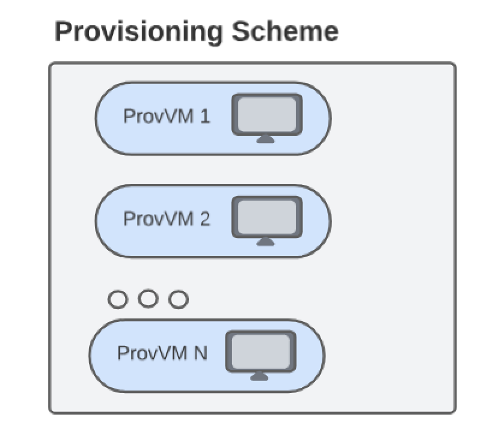
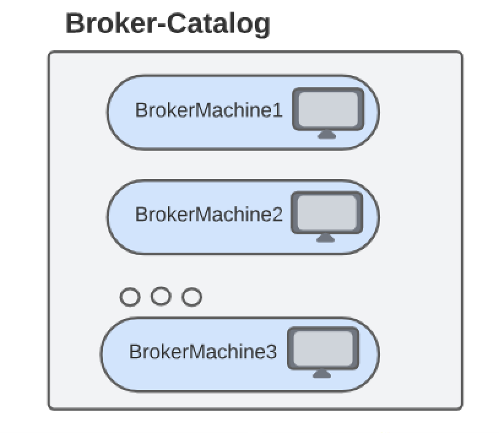
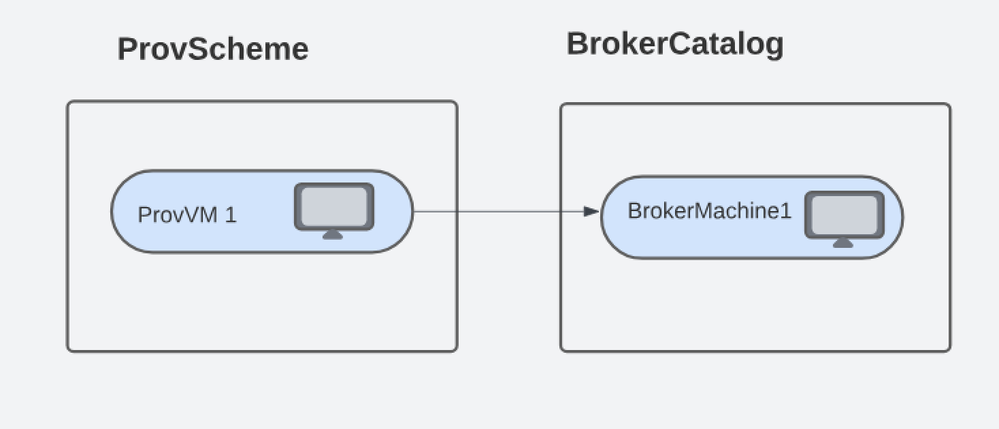

# Life cycle of a Virtual Machine in Azure
## Overview
A ProvVM is a virtual machine that is created based on a ProvScheme. A ProvScheme can have many ProvVMs.
A BrokerCatalog contains BrokerMachines. Each ProvVM must have an associated BrokerMachine created in order to view the machine through Citrix Studio, enable power management, and allow for it to be assigned to a delivery group.

The following figure shows a ProvScheme with multiple ProvVMs in it.\

The following figure shows a BrokerCatalog with multiple BrokerMachines in it.\

A BrokerMachine will be established in the catalog for each ProvVM in the ProvScheme.\

This folder contains scripts for various operations, including provisioning a new virtual machine, updating an existing virtual machine, removing a virtual machine, and retrieving details of a provisioned virtual machine.
1. Add ProvVM scripts - To provision a virtual machine in an existing provisioning scheme
2. Get ProvVM scripts - To get the information of an existing virtual machine
3. Update ProvVM scripts - To update different settings on the existing virtual machine
4. Remove ProvVM scripts - To remove/forget/purge an existing virtual machine