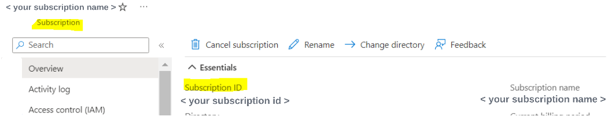
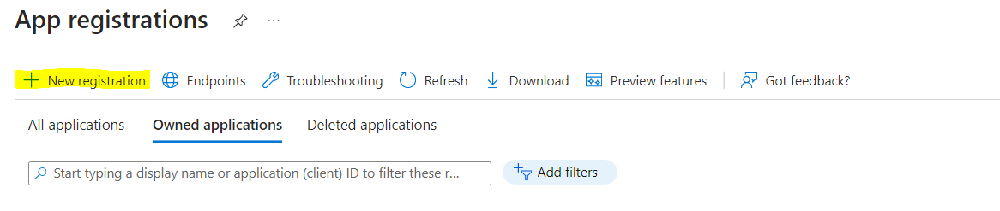
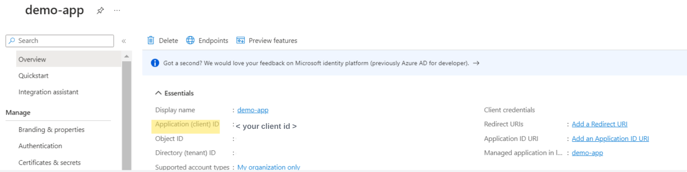
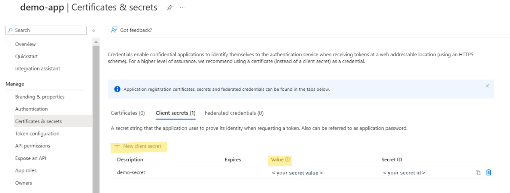
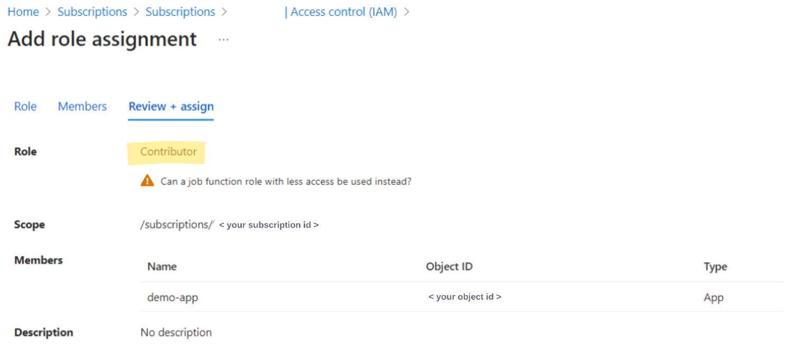
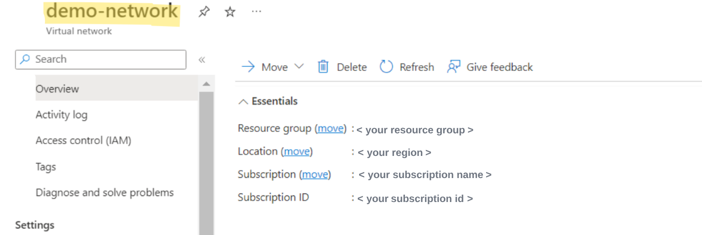
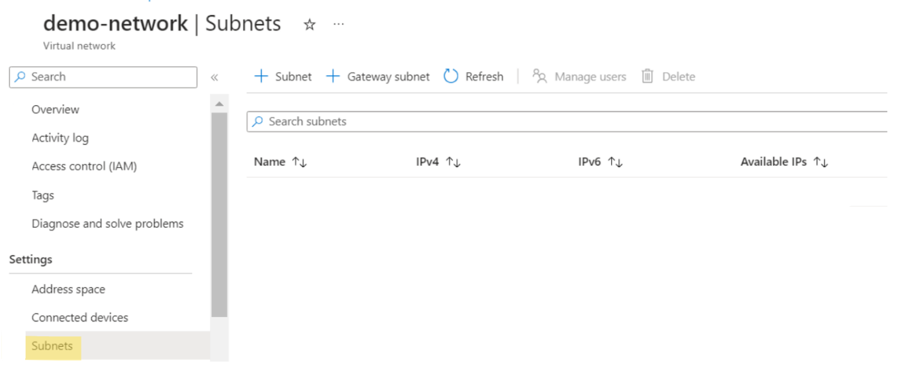
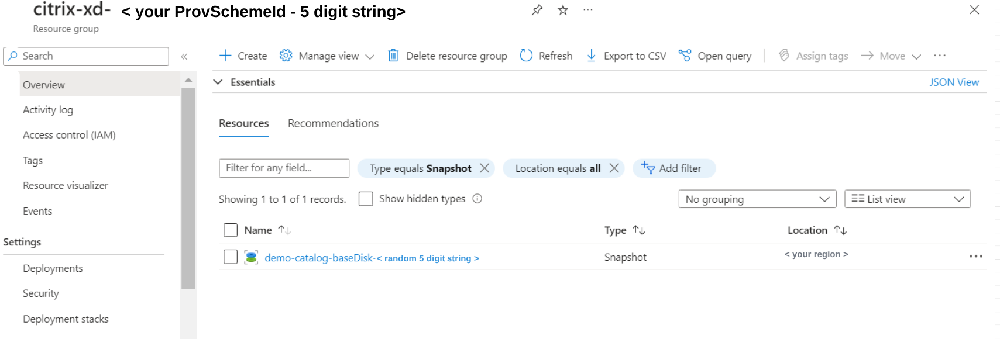
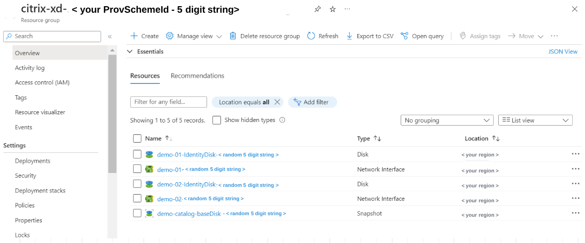
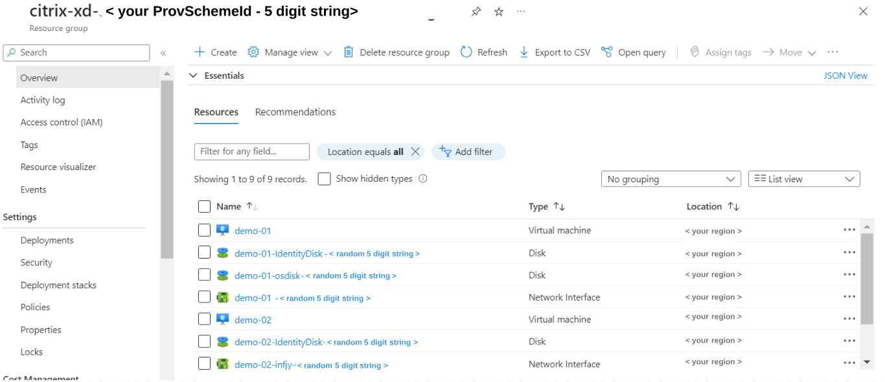

# Azure: Citrix MCS PowerShell Samples 
Scripts in this folder are tailored to Azure and its unique features. As mentioned in the [MCS README](../README.md), there are 5 major building blocks to consider.
- **Hosting Connection**
	- An Azure Service Principal is required to create an Azure connection. This gives MCS access to create resources in your Azure environment.
	- To learn more about Azure connections, see https://docs.citrix.com/en-us/citrix-daas/install-configure/connections/connection-azure-resource-manager
- **Hosting Unit**
	- An Azure hosting unit must specify a region. This is where your MCS resources will be provisioned.
	- An Azure hosting unit must specify at least one network. This is the network that your provisioned VMs will use.
- **Identity**
  - MCS provisioned Azure VMs support non-domain-joined, AD joined, Azure AD joined and Hybrid Azure AD joined as machine identity types.
  - MCS provisioned Azure AD joined VMs support to be placed in Azure AD dynamic security group.
  - MCS provisioned Azure VMs support Microsoft Intune as device management type.
  - To learn more about how to create machine identities joined catalogs see https://docs.citrix.com/en-us/citrix-daas/install-configure/create-machine-identities-joined-catalogs 
- **ProvScheme**
	- Azure ProvSchemes supports a variety of Custom Properties, which can be used to customize your configuration.
	- To learn more about Azure ProvSchemes, see https://docs.citrix.com/en-us/citrix-daas/install-configure/machine-catalogs-create/create-machine-catalog-citrix-azure
- **ProvVM**

Note: Unless otherwise specified, these scripts are written with Citrix DaaS in mind. To tailor the scripts to CVAD, you should provide the -AdminAddress parameter. For more information, please refer to: https://developer-docs.citrix.com/en-us/citrix-virtual-apps-desktops-sdk/current-release 

## Features
This repository contains examples of several Azure & MCS features. Note that this is not an exhaustive list; there are many Azure & MCS features that are not listed here. The features listed below are those that currently have examples in this repository:
- [MachineProfile](ProvScheme/MachineProfile)
- [Provisioning into Availability Zones](ProvScheme/Availability%20Zones)
- [Setting disk StorageType](ProvScheme/Set%20the%20disk%20storage%20type)
- [Save storage costs at shutdown](ProvScheme/Save%20storage%20costs%20at%20shutdown)
- [MCS Storage Optimization](ProvScheme/MCS%20Storage%20Optimization)
- [Ephemeral OS Disks](ProvScheme/Ephemeral%20OS%20Disks)
- [Provision into Existing Resource Groups](ProvScheme/Provision%20into%20Existing%20Resource%20Groups)

## Sample Admin Scenario Scripts
This repository contains common scripts for admins:
- [CreateCatalog.ps1](SampleAdminScenarios/CreateCatalog.ps1)
This script is similar to the "Create Machine Catalog" button in Citrix Studio. It creates the identity pool, ProvScheme, Broker Catalog, AD Accounts, and ProvVms.

## Azure Environment Setup & Considerations
When creating an Azure Hosting Connection, you will be prompted for several environmental parameters. These include:
- **HypervisorAddress (Azure Environment)**. This is the Azure endpoint. For Azure Global, the endpoint is: *<https://management.azure.com/>*
- **Subscription ID.** Your Azure Subscription ID can be found by going to Azure Portal > Subscriptions > Overview. The Subscription ID is a GUID.\
	
- **Active Directory ID.** This is your Azure Tenant ID. You can find this by going to Azure Portal > Tenant Properties.
- **Application ID & Application Secret.** This is the client ID of the app you registered and the associated secret. MCS provisioning requires permission to access your Azure environment. This access is given through [Azure Service Principals](https://docs.citrix.com/en-us/citrix-daas/install-configure/connections/connection-azure-resource-manager#create-service-principals-and-connections).
    -   To create a Service Principal, go to Azure Portal > App Registrations > New Registration\
		
    -   Once this is created, go to your app and look for the Application (client id). ***This is the Application ID/Username to use when making your Azure Hosting Connection with MCS.***\
        
    -   Next, navigate to Certificates & secrets under your Application. Add a new secret. ***The Value is the Application Secret/Password to use when making your Azure Hosting Connection with MCS.***\
        
    -   Finally, associate your app with your subscription. In Azure Portal, search for Subscriptions and open your Subscription. Go to IAM > Add Role Assignment. Citrix recommends providing the Contributor role, but you can also setup a minimum permission set using [this guide](https://docs.citrix.com/en-us/citrix-daas/install-configure/connections/connection-azure-resource-manager.html#required-azure-permissions).\
        

More information on creating hosting connections can be found [here](Hosting%20Connection).

When creating an Azure Hosting Unit, you will need to supply networking and region configuration information:
- **Region**. This is the Azure region where you would provision your resources.
    -   For example, if you want to provision in the East US region, you would supply the region as "East US"
- **Network**. This is the Azure Virtual Network that will be used by your provisioned VMs. To view your available networks. go to Azure Portal > Virtual Networks.\
    
- **Subnet.** This is the Azure Subnet that your provisioned VMs will use. This subnet must exist under the Virtual Network (supplied above). To view available subnets, go to Virtual Network > Subnets\
    

More information on creating hosting units can be found [here](Hosting%20Unit).

When you create an MCS catalog, resources are created in your Azure Subscription. By default, MCS creates an Azure Resource Group and provision resources into that Resource Group. The naming convention for this resource group is 'citrix-xd-{ProvisioningSchemeId}-{unique 5 digit string}'. During catalog creation, a basedisk snapshot or Azure Compute Gallery will be created. In this example, the basedisk is saved as a snapshot:\

When a machine is added to the catalog, an identity disk and a network interface (NIC) are created. MCS uses on-demand provisioning, meaning that the VM & OS Disk are not created until the first power on. In this example, 2 VMs were added to the catalog:\

Next, we power on the VMs. This creates the VM and the OS Disk:\

More information on creating catalogs & VMs can be found in the [Identity](Identity), [ProvScheme](ProvScheme), and [ProvVm](ProvVm) folders.

Types of Disks in MCS & Azure
-----------------------------

MCS & Azure support several different types of disks. These include:

- **OS Disks.** The OS Disk contains the operating system/boot volume.
    -   You can optionally use ephemeral OS Disks, where your OS Disk is stored on the cache or temporary disk.
    -   <https://learn.microsoft.com/en-us/azure/virtual-machines/managed-disks-overview#os-disk>
- **Azure temporary disks.** Temporary disks are non-persistent disks used for short-term storage. It holds data that may be lost during maintenance events or when the VM is power managed.
    -   <https://learn.microsoft.com/en-us/azure/virtual-machines/managed-disks-overview#temporary-disk>
- **Cache disks.** This is the VM's OS cache disk.
- **MCSIO Write-back cache disk  (WBC).** This is a data disk that MCS can optionally attach to the VM. MCSIO can help achieve high IOPs by providing a two-tier caching system.
    -   <https://citrixblogs.wpengine.com/2020/04/22/enable-persist-write-back-cache-for-mcs-pooled-catalog-in-azure-part-1/>