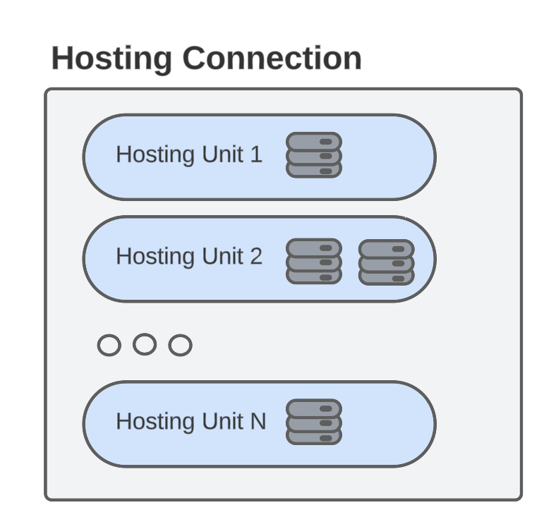

# Life cycle of a Hosting Connection in GCP
## Overview
A Hosting Connection serves as a bridge to your underlying Hypervisor and/or cloud platform, where your VMs are located. Hypervisor could be Microsoft's Hyper-V, VMware's vSphere or Citrix's XenServer and cloud platforms include Google Cloud Platform, Microsoft Azure or AWS.
Multiple hosting units can be associated with each hosting connection in GCP. These hosting units define the GCP resources, like region and networks, which are utilized for provisioning virtual machines.

The following diagram illustrates HostingUnits located within a HostingConnection.\

This folder includes four scripts designed to facilitate users in performing CRUD (Create, Read, Update, Delete) operations on Hosting Connection.
1. Add HostingConnection scripts - To create a hosting connection
2. Get HostingConnection scripts - To get the information of an existing hosting connection
3. Update HostingConnection scripts - To edit different settings on the existing hosting connection
4. Remove HostingConnection scripts - To remove an existing hosting connection