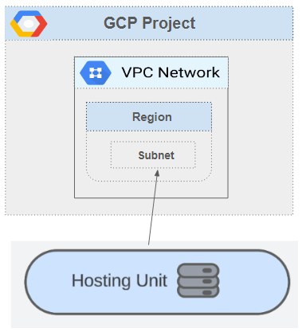

# Life cycle of a Hosting Unit in GCP
## Overview
Hosting units provide information required by the Machine Creation Services to create and manage virtual machines that can be used by other services. A hosting unit references a root path, a specific point in the provider connection tree. The hosting unit is constrained to provide only items below this point in the tree. This restricts the locations the Machine Creation Service can use to create virtual machines and what VPCs/subnets to use.
A hosting unit can be used to create multiple ProvSchemes. A ProvScheme may have multiple ProvVMs.

The following diagram illustrates HostingUnits located within a HostingConnection.\

The diagram below depicts relationship between Hosting unit, GCP project and VPC.\

There are four scripts in this folder which helps the user to perform CRUD (Create, Read, Update, Delete) operations on Hosting Unit for GCP.
1. Add HostingUnit scripts - To create a hosting unit
2. Get HostingUnit scripts - To get the information of an existing hosting unit
3. Update HostingUnit scripts - To edit different settings on the existing hosting unit
4. Remove HostingUnit scripts - To remove an existing hosting unit