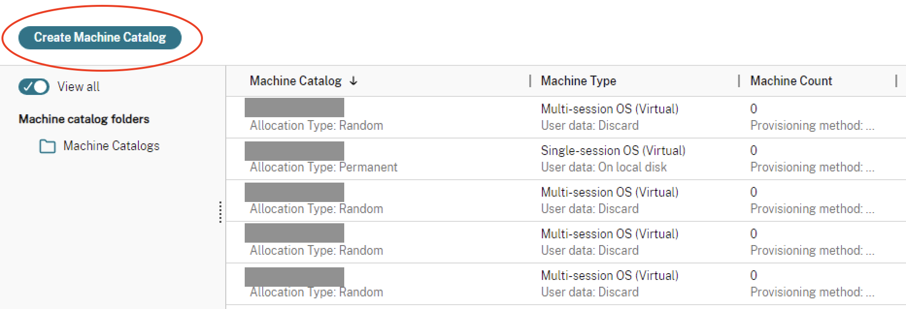
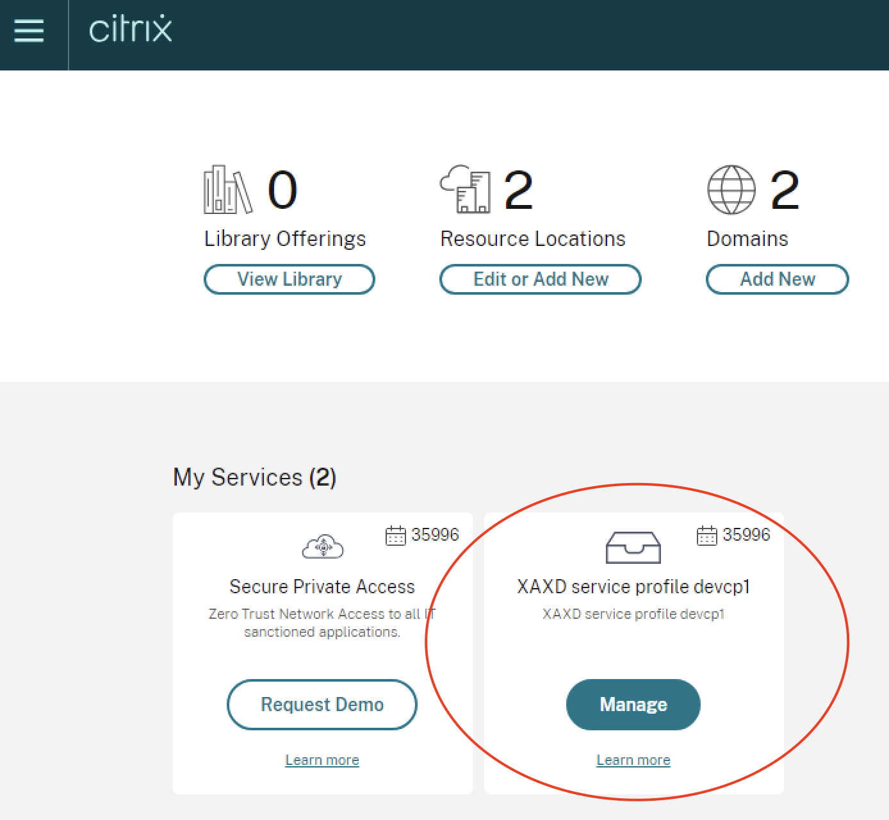

# GCP Citrix MCS PowerShell Samples

## Overview

Scripts in this folder are tailored to GCP and its unique features. As mentioned in the [MCS README](../README.md), there are 5 major building blocks to consider.
- **Hosting Connection**
	- To learn more about GCP connections, see https://docs.citrix.com/en-us/citrix-virtual-apps-desktops/install-configure/connections/connection-GCP
- **Hosting Unit**
	- A GCP hosting unit must specify an availability zone. This is where your MCS resources will be provisioned.
	- A GCP hosting unit must specify at least one network. This is the network that your provisioned VMs will use.
- **Identity**
  - MCS provisioned GCP VMs support non-domain-joined, AD joined, and Hybrid Azure AD joined as machine identity types.
  - To learn more about how to create machine identities joined catalogs see https://docs.citrix.com/en-us/citrix-daas/install-configure/create-machine-identities-joined-catalogs 
- **ProvScheme**
	- GCP ProvSchemes supports a variety of Custom Properties, which can be used to customize your configuration.
	- To learn more about GCP ProvSchemes, see https://docs.citrix.com/en-us/citrix-daas/install-configure/machine-catalogs-create/create-machine-catalog-GCP
- **ProvVM**

Note: Unless otherwise specified, these scripts are written with Citrix DaaS in mind. To tailor the scripts to CVAD, you should provide the -AdminAddress parameter. For more information, please refer to: https://developer-docs.citrix.com/en-us/citrix-virtual-apps-desktops-sdk/current-release 

## Features
This repository contains examples of several GCP & MCS features. Note that this is not an exhaustive list; there are many GCP & MCS features that are not listed here. The features listed below are those that currently have examples in this repository:
- [Machine Profile](ProvScheme/Machine%20Profile)
- [Setting disk StorageType](ProvScheme/Set%20the%20disk%20storage%20type)

## Sample Admin Scenario Scripts
This repository contains common scripts for admins:

### Create Catalog
[CreateCatalog.ps1](SampleAdminScenarios/CreateCatalog.ps1)
This script is similar to the "Create Machine Catalog" button in Citrix Studio. It creates the identity pool, ProvScheme, Broker Catalog, AD Accounts, and ProvVms.<br>
[Create-Catalog-from-DiskImage-in-Diff-Region.ps1](SampleAdminScenarios/Create-Catalog-from-DiskImage-in-Diff-Region.ps1)
This script is similar to the "Create catalog". However, it creates an MCS ProvisioningScheme from a Disk Image in a different region.<br><br>


## GCP Environment Setup & Considerations
Make sure you set up your GCP account as a resource location and have the necessary resources. Checkout [GCP Cloud environment](https://docs.citrix.com/en-us/citrix-virtual-apps-desktops/install-configure/install-prepare/GCP) for more information.

### <a name="zone"></a> Zone
Using zones, you can group items in your site to streamline and improve your network performance. A zone can include items in a geographic location, or it can be another grouping type for your unique deployment.

#### Studio UI

From the Citrix Console, go to XAXD service profile<br><br>


Then on the navigation side bar, go to **Zones**<br><br>


You should see the list of Zones.<br>
**Note**: You cannot get the Zone Uid from here.

#### Powershell

Use the powershell command `Get-ConfigZone`
```powershell
# If you know the name, you can use the name parameter to get directly the Zone UID
$configZone = Get-ConfigZone -Name "demo-zone"
$configZoneUid = $configZone.Uid
# If you don't know the name of the zone, you can Get-ConfigZone and look through all the zones to find the one you want to use
Get-ConfigZone
```

There are other parameters you can use to filter the list of Config Zones if you don't know the name. <br>[More info about Get-ConfigZone](https://developer-docs.citrix.com/en-us/citrix-virtual-apps-desktops-sdk/current-release/CentralConfig/Get-ConfigZone.html)

To create a Config Zone/Resource Location, refer to https://docs.citrix.com/en-us/citrix-daas/install-configure/resource-location/GCP-host

### <a name="api-key"></a> API Key

An API key is an alphanumeric string that API developers use to control access to their APIs.The Citrix Cloud Service Account key is required for creating a connection in Citrix DaaS. The key is contained in a credential file (.json). The file is automatically downloaded and saved to the Downloads folder after you create the key. When you create the key, be sure to set the key type to JSON. Otherwise, the Citrix Full Configuration interface cannot parse it.

To create a Service Account Key, navigate to IAM & Admin > Service accounts and click the email address of the Citrix Cloud Service Account. Switch to the Keys tab and select Add Key > Create new key. Make sure to select JSON as the key type.

**Note**:Create keys using the Service accounts page in the Google Cloud console. We recommend that you change keys regularly for security purposes. You can provide new keys to the Citrix Virtual Apps and Desktops application by editing an existing Google Cloud connection.

To learn more about Api keys, refer to the following GCP docs
- https://cloud.google.com/docs/authentication/api-keys

### <a name="vpc"></a> VPC

Google Cloud Virtual Private Cloud (GCP VPC) enables you to launch GCP resources into a virtual network that you've defined. Shared VPCs are desirable options for larger installations because they provide centralized control, usage, and administration of shared corporate Google cloud resources. 

To view and get the VPC ID<br>
1. Open the GCP VPC console at https://console.cloud.google.com/networking/networks
2. In the left navigation pane, choose **VPC networks**.<br>


To learn more about VPC, checkout [GCP VPC Documentation](https://cloud.google.com/vpc/docs/subnets). 
For more information on Shared VPC, see the Google Documentation site at [GCP Shared VPC Documentation](https://cloud.google.com/vpc/docs/shared-vpc).

### <a name="network"></a> Network

To view and get the network<br>
1. Select the desired VPC at https://console.cloud.google.com/networking/network
2. On the top navigation pane, choose **Subnets**.<br>

3. Select the subnet you want to use.
4. Under **Primary IPv4 range** is the IP Address you will use.<br>

To construct a network path replace the correct value in the parts in quotations:<br>
- XDHyp:\Connections\\"insert connection name"\\"VPC name".virtualprivatecloud\\("Subnet Name").network

To construct a shared VPC network path replace the correct value in the parts in quotations:<br>
- XDHyp:\Connections\\"insert connection name"\\"VPC name".sharedvirtualprivatecloud\\("Subnet Name").network

For example, a Network Path would look something like this: 
- XDHyp:\Connections\demo-connection\demo-VPC.virtualprivatecloud\demo-subnet.network
- XDHyp:\Connections\demo-connection\demo-VPC.sharedvirtualprivatecloud\demo-subnet.network