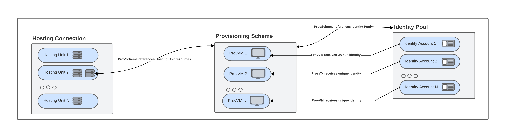
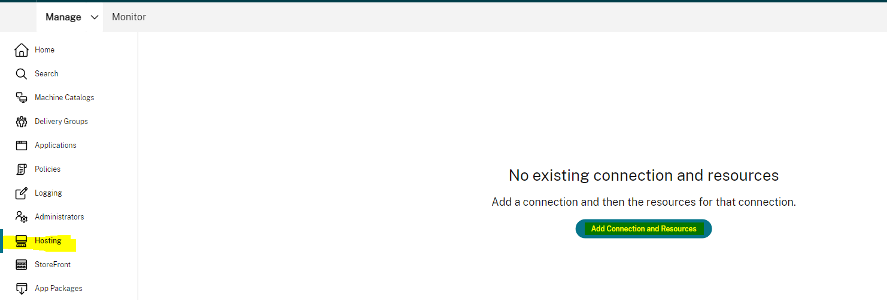
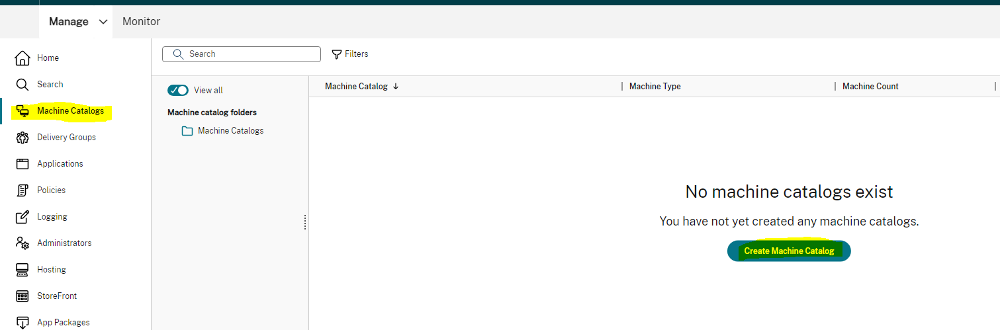
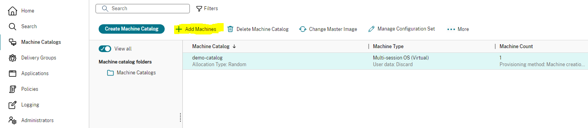

# SDK Samples for Citrix&reg; Machine Creation Services (MCS)
The goal of this open source repository is to provide sample scripts for admins who are using Machine Creation Services (MCS) Provisioning. This repository contains sample PowerShell scripts for DaaS and on-prem deployments. These scripts include:
- Starter scripts for core MCS PowerShell cmdlets for learning how to start using MCS PowerShell cmdlets for CRUD operations.
- Feature-specific scripts for exploring a specific MCS-feature. Features are hosting platform specific, meaning that each hosting platform will have a different feature set.
- Admin scripts for implementing common end-to-end scenarios, such as creating a catalog.

The scripts provided are as is and not officially supported by Citrix Support. Please refer to the sections below for specifics on license and supportability.

Throughout this page, Citrix developer docs are referenced so you can learn more about specific cmdlets. Generally, these docs link to Citrix DaaS. If you are looking for the equivalent CVAD links, please refer to: https://developer-docs.citrix.com/en-us/citrix-virtual-apps-desktops-sdk/current-release

## Prerequisites
The scripts in this repository utilize Citrix PowerShell cmdlets. 
For Cloud deployments (DaaS), these scripts can be run via the Remote PowerShell SDK. Once downloaded, you can run the `Get-XdAuthentication` cmdlet to authenticate to Citrix Cloud. This must be done once per PowerShell session. Once completed, you can run the PowerShell cmdlets on your remote machine. For more information on how to set this up, refer to https://docs.citrix.com/en-us/citrix-daas/sdk-api#citrix-daas-remote-powershell-sdk

For on-prem deployments (CVAD), the cmdlets can be run directly on the DDC or remotely. With CVAD, you will need to specify the `-AdminAddress` parameter when calling the Citrix cmdlets. For example, `-AdminAddress` can be added to the New-ProvScheme command as shown here: 
```powershell
New-ProvScheme -AdminAddress "localhost:19097"
-CleanOnBoot:$isCleanOnBoot 
-ProvisioningSchemeName $provisioningSchemeName 
-HostingUnitName $hostingUnitName 
-IdentityPoolName $identityPoolName 
-InitialBatchSizeHint $numberOfVms 
-MasterImageVM $masterImageVm 
-NetworkMapping $networkMapping 
-CustomProperties $customProperties 
-MachineProfile $machineProfile
```
For more information, refer to https://support.citrix.com/article/CTX222326/how-to-configure-powershell-sdk-and-execute-commands-remotely-in-xenappxendesktop-7x

To view the version of the PowerShell SDK, navigate to Control Panel > Programs > Programs and Features. If you need to view the version of each individual Citrix PowerShell snap-in, run the following Powershell command: 
```powershell
Get-Package | Where-Object Name -Like 'Citrix*' | Sort-Object Name | Select Name, Version
```

To view the installed Citrix PowerShell snap-ins and PSVersions, run the following Powershell command: 
```powershell
Get-PsSnapin -Registered Citrix.*
```

To view the Citrix PowerShell snap-ins that have been added to the current session, run the following PowerShell command: 
```powershell
Get-PsSnapin 
```

## Getting Started
To start using the scripts, you can clone the repository to your local machine. Note that these scripts may create resources in your environment. Before running a script, review the content to understand the environmental impact. To clone the repository:
```
git clone https://github.com/citrix/citrix-mcs-sdk-samples.git
```
### Navigating the Repository
The repository is sorted by hosting platform/hypervisor, with each platform having its own folder. Within each folder, scripts are sorted by the major logical operation:
- Hosting Connection
- Hosting Unit
- Identity
- ProvScheme
- ProvVM

Each folder contains:
- Basic starter scripts for CRUD operations. These scripts show basic examples of the MCS PowerShell cmdlets. You can copy these scripts locally and start adding to them as needed for your use case.
- Feature-specific folders. These folders contain examples of how to adjust the PowerShell cmdlets to start using a specific feature.

Each hosting platform also contains a folder called SampleAdminScenarios. This contains scripts for common MCS admin operations (such as end-to-end catalog creation).

## MCS Building Blocks
With Machine Creation Services (MCS), you can provision and power manage virtual machines in major hosting platforms. There are several building blocks required for an end-to-end MCS deployment:
- **Hosting Connection**
    - This is a connection between Citrix and the hosting platform. Typically, the hosting connection includes a URL, a set of credentials, and a hosting platform/hypervisor type.
    - To learn more about connections, see https://docs.citrix.com/en-us/citrix-daas/install-configure/connections
- **Hosting Unit**
    - Hosting Units reside under hosting connections. They define hypervisor resources, such as storage, that can be used to provision virtual machines.
    - To learn more about hosting units, see https://docs.citrix.com/en-us/citrix-daas/install-configure/machine-catalogs-create#overview
- **Identity**
    - An Identity Pool is a collection of machine identities. Each machine in a Provisioning Scheme will have a unique identity under the identity pool. 
    - To learn more about identity, see https://docs.citrix.com/en-us/citrix-daas/install-configure/machine-catalogs-create#machine-identities
- **Provisioning Scheme (ProvScheme)**
    - Provisioning Schemes can be thought of as a template that stores a VM configuration. It includes information such as CPU, Memory Size, Master Image Path, etc. All virtual machines under a Provisioning Scheme are created from this base template.
    - To learn more about Provisioning Schemes, see:
https://docs.citrix.com/en-us/citrix-daas/install-configure/machine-catalogs-create#overview
https://support.citrix.com/article/CTX233505/provisioning-schemefaqs
- **Provisioned VM (ProvVM)**
    - A ProvVM is a virtual machine that is created based on a ProvScheme. ProvSchemes can have many ProvVMs, and each ProvVM has a unique identity.
    - To learn more about ProvVMs, see https://docs.citrix.com/en-us/citrix-daas/install-configure/machine-catalogs-create.html#machines

A visual representation of how these components fit together is shown below:


For a deeper dive into the MCS architecture, we recommend reviewing these documents:
- https://developer-docs.citrix.com/en-us/citrix-virtual-apps-desktops-sdk/current-release/understanding-xendesktop-administration-model
- https://docs.citrix.com/en-us/tech-zone/design/reference-architectures/image-management.html#machine-creation-services-mcs
- https://docs.citrix.com/en-us/tech-zone/design/design-decisions/image-management.html


## Creating an MCS Connection, Catalog, and Machines
Now that we understand the basic building blocks, let's put it all together. This section reviews the steps in creating a catalog for MCS provisioning. Consider the Studio UI, which includes several buttons to automate tasks. Behind the scenes, the UI is calling PowerShell cmdlets. This section maps the Studio UI buttons to the PowerShell cmdlets.

### Add Connection and Resources: 
-   ***Studio UI***\
	!
-   ***Equivalent PowerShell cmdlets***
    1.  First, a Hosting Connection is created:
        1.  [**Set-HypAdminConnection**.](https://developer-docs.citrix.com/en-us/citrix-daas-sdk/hostservice/set-hypadminconnection) Sets the controller address to be used by the cmdlets.
        2.  **New-Item.** Creates the connection to the hosting platform.
        3.  [**New-BrokerHypervisorConnection.**](https://developer-docs.citrix.com/en-us/citrix-daas-sdk/broker/new-brokerhypervisorconnection) Adds the connection to the Broker service.
    2.  Next, a Hosting Unit is created:
        1.  **New-Item.** Creates the hosting unit (or resources).

More information on the process can be found here: <https://developer-docs.citrix.com/en-us/citrix-virtual-apps-desktops-sdk/current-release/creating-and-configuring-a-host.html>

### Create Machine Catalog
-   ***Studio UI***\
	!
-   ****Equivalent PowerShell cmdlets****
    1.  Create the Broker Catalog:
        1.  **[New-BrokerCatalog.](https://developer-docs.citrix.com/en-us/citrix-daas-sdk/broker/new-brokercatalog)** This adds a new Broker Catalog to the site. It is not yet associated with a Provisioning Scheme.
    2.  Create the Identity Pool:
        1.  [**New-AcctIdentityPool.**](https://developer-docs.citrix.com/en-us/citrix-daas-sdk/adidentity/new-acctidentitypool) Creates a new identity pool, which will store the AD accounts for the provisioned VMs.
        2.  [**Set-BrokerCatalogMetadata.**](https://developer-docs.citrix.com/en-us/citrix-daas-sdk/broker/set-brokercatalogmetadata) Associates the broker catalog and the identity pool.
    3.  Create the Provisioning Scheme:
        1.  [**New-ProvScheme.**](https://developer-docs.citrix.com/en-us/citrix-daas-sdk/machinecreation/new-provscheme) Creates the ProvScheme.
        2.  [**Set-BrokerCatalog.**](https://developer-docs.citrix.com/en-us/citrix-daas-sdk/broker/set-brokercatalog) Associates the broker catalog and the ProvScheme.
        3.  [**Add-ProvSchemeControllerAddress.**](https://developer-docs.citrix.com/en-us/citrix-daas-sdk/machinecreation/add-provschemecontrolleraddress) Adds controller address to the ProvScheme object.
    4.  Provision the VM(s):
        1.  [**New-AcctADAccount**](https://developer-docs.citrix.com/en-us/citrix-daas-sdk/adidentity/new-acctadaccount). Creates AD Accounts for the VMs.
        2.  [**New-ProvVm.**](https://developer-docs.citrix.com/en-us/citrix-daas-sdk/machinecreation/new-provvm) Create the virtual machine based on the ProvScheme.
        3.  [**New-BrokerMachine.**](https://developer-docs.citrix.com/en-us/citrix-daas-sdk/broker/new-brokermachine) Create a Broker Machine object, which associates the VM with the Broker catalog.

More information on the process can be found here: <https://developer-docs.citrix.com/en-us/citrix-virtual-apps-desktops-sdk/current-release/creating-a-catalog>

### Add machines
-   ***Studio UI***\
	!
-   ****Equivalent PowerShell cmdlets****
    1.  [**New-AcctADAccount**](https://developer-docs.citrix.com/en-us/citrix-daas-sdk/adidentity/new-acctadaccount). Creates AD Accounts for the VMs. *Note:* ADAccount creation in DaaS may take a bit longer than in CVAD due to actions being routed through the Cloud Connector. 
    2.  [**New-ProvVm.**](https://developer-docs.citrix.com/en-us/citrix-daas-sdk/machinecreation/new-provvm) Create the virtual machine based on the ProvScheme. 
    3.  [**New-BrokerMachine.**](https://developer-docs.citrix.com/en-us/citrix-daas-sdk/broker/new-brokermachine) Create a Broker Machine object, which associates the VM with the Broker catalog. 

### A Note on Configuration Logging Operations
For each of the above operations, you can optionally configure a high-level logging operation. The Studio UI automatically triggers these logging operations for actions that alter the configuration of your site (ex: creating a hosting unit, creating a catalog, etc). To Start or Stop a logging operation, you can use the following cmdlets:
1.  **[Start-LogHighLevelOperation](https://developer-docs.citrix.com/en-us/citrix-daas-sdk/ConfigLogging/Start-LogHighLevelOperation.html).** Starts a logging operation with a Log ID, which can be used to link subsequent commands in the operation.
2.  **[Stop-LogHighLevelOperation](https://developer-docs.citrix.com/en-us/citrix-daas-sdk/configlogging/stop-loghighleveloperation)**. Completes the logging operation.

**Note:** Some provisioning operations, such as New-ProvScheme and New-ProvVM, are long-running tasks. You can check the status of a task via the [Get-ProvTask](https://developer-docs.citrix.com/en-us/citrix-daas-sdk/machinecreation/get-provtask) command.

## License Agreement
To review our license agreement, please see [LICENSE.txt](LICENSE.txt)