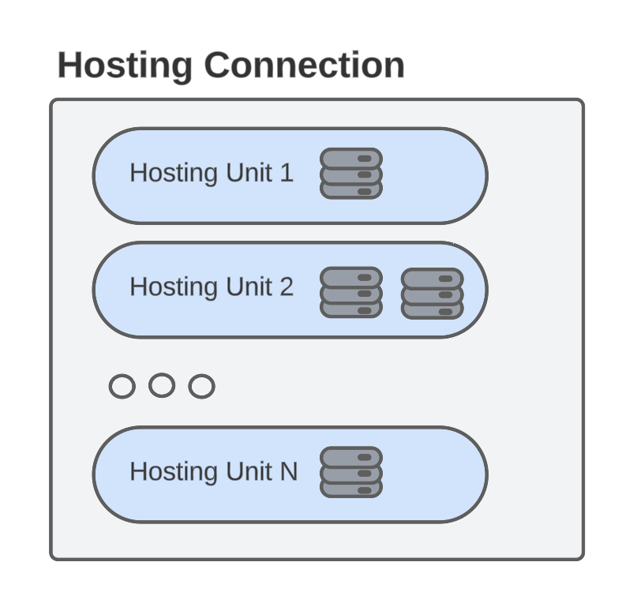
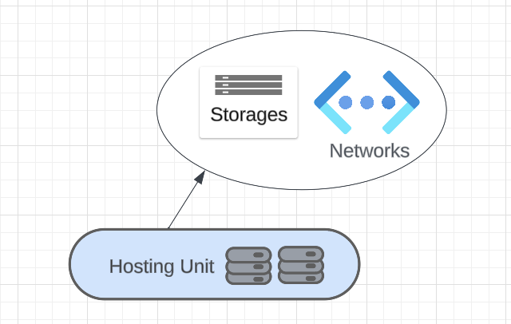

# Life cycle of a Hosting Unit in SCVMM
## Overview
Hosting units provide information to the Machine Creation Services required to create and manage virtual machines that can be used by other services. A hosting unit references a root path. This is a specific point in the provider connection tree. The hosting unit is constrained to provide only items below this point in the tree. This restricts the locations that the Machine Creation Service can use to create virtual machines and the networks and storage that can be used.
A single hosting unit has the capability to be utilized in the creation of multiple ProvSchemes. And a single ProvScheme has multiple ProvVMs.

The following diagram illustrates HostingUnits located within a HostingConnection.\

The diagram below depicts a HostingUnit containing multiple ProvSchemes.\

There are four scripts in this folder which helps the user to perform CRUD(Create, Read, Update, Delete) operations on Hosting Unit for SCVMM.
1. Add HostingUnit scripts - To create a hosting unit
2. Get HostingUnit scripts - To get the information of an existing hosting unit
3. Update HostingUnit scripts - To edit different settings on the existing hosting unit
4. Remove HostingUnit scripts - To remove an existing hosting unit