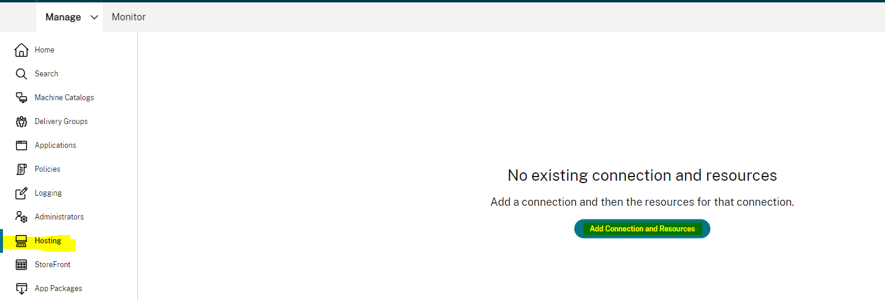
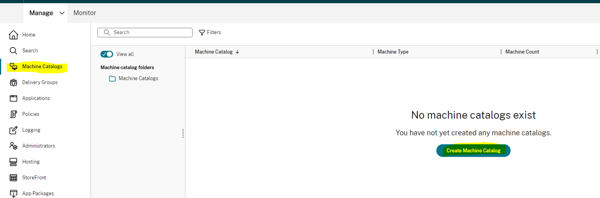

# SCVMM: Citrix MCS PowerShell Samples 
Scripts in this folder are tailored to SCVMM/HyperV and its unique features. As mentioned in the [MCS README](../README.md), there are 5 major building blocks to consider.
- **Hosting Connection**
	- A SCVMM user role with proper rights is required to create a hosting connection.
	[Reference](https://learn.microsoft.com/en-us/system-center/vmm/manage-account?view=sc-vmm-2019#role-based-security)
		- The administrator user role is created by default in SCVMM.
		- The user must be created in Active Directory before creating a user role in SCVMM.
	- To learn more about SCVMM connections, see https://docs.citrix.com/en-us/citrix-daas/install-configure/connections/connection-mscvmm
- **Hosting Unit**
	- A SCVMM hosting unit must specify a storage. This is where your MCS resources will be provisioned.
	- A SCVMM hosting unit must specify at least one network. This is the network that your provisioned VMs will use.
- **Identity**
	- Identity types such as Hybrid Azure AD , Azure AD are not supported in SCVMM.
- **ProvScheme**
	- SCVMM ProvSchemes can be created using Master Image, Machine Profile to customize configurations.
	- To learn more about SCVMM ProvSchemes, see https://docs.citrix.com/en-us/citrix-daas/install-configure/machine-catalogs-create/create-machine-catalog-mscvmm
- **ProvVM**
	- SCVMM does not support updating the properties of existing machines.

**Note:** Unless otherwise specified, these scripts are written with Citrix DaaS in mind. To tailor the scripts to CVAD, you should provide the -AdminAddress parameter. For more information, please refer to: https://developer-docs.citrix.com/en-us/citrix-virtual-apps-desktops-sdk/current-release 

## Features
This repository contains examples of SCVMM & MCS features. The features listed below are those that currently have examples in this repository:
- [MachineProfile](../SCVMM/ProvScheme/Machine%20Profile)
- [MCS Storage Optimization](../SCVMM/ProvScheme/MCS%20Storage%20Optimization)

## Sample Admin Scenario Scripts
This repository contains common scripts for admins:

### CreateHostingResources
[CreateHostingResources.ps1](SampleAdminScenarios/CreateHostingResources.ps1)
This script is similar to the "Add Connection and Resources". It creates the Hosting Connection and Hosting Unit.<br>


### Create Catalog
[CreateCatalog.ps1](SampleAdminScenarios/CreateCatalog.ps1)
This script is similar to the "Create Machine Catalog" button in Citrix Studio. It creates the identity pool, ProvScheme, Broker Catalog, AD Accounts, and ProvVms.<br>


### Remove Catalog
[RemoveCatalog.ps1](SampleAdminScenarios/RemoveCatalog.ps1)
This script is similar to the "Delete Machine Catalog" button in Citrix Studio. It removes the identity pool, ProvScheme, Broker Catalog, AD Accounts, and ProvVMs.<br>


## SCVMM Environment Setup & Considerations
Before creating a SCVMM hosting connection, you need to make an user role on SCVMM environment. <br>
- You must create a user in Active Directory before creating an user role. 
- You can create an user role by login into SCVMM portal > Settings > Create User Role.\
	
	- The administrator user role is created by default in SCVMM.
- To learn more about user roles, see
[Reference](https://learn.microsoft.com/en-us/system-center/vmm/manage-account?view=sc-vmm-2019#role-based-security)
	
After you create user role,you will be prompted for several environmental parameters to create hosting connection.\


These include:
- **Connection Address (SCVMM Environment)** This is the URL address of the machine which has SCVMM server installed.\
	 <br>
	- Also , you could run ```Get-VMMServer -ComputerName "demoscvmmcomputer"``` to get the connection address.
- **Username** This is the username of the user account for which the above user role is created.
- **Password** This is the password for the user account.

More information on creating hosting connections can be found [here](../SCVMM/Hosting%20Connection).

When creating a SCVMM Hosting Unit, you will need to supply networking and storage configuration information:
- **Storage**. This is the storage location where you would provision your resources.\
	 <br>
    - In SCVMM , the storage is located on different clusters and hosts inside those clusters.
	- For example, if you want to provision in the Host1 host, you would supply the host as "Host1" in studio.
- **Network**. This is the network that will be used by your provisioned VMs. 
	To view your available networks, go to SCVMM Portal > Fabric >Logical Networks.\
	 <br>

More information on creating hosting units can be found [here](../SCVMM/Hosting%20Unit).

When you create an MCS catalog, virtual machines are created in your SCVMM environment.\
 <br>

However, the identity disk, differencing disk, base disk are created in Hyper-V host.\
 <br>
 <br>

More information on creating catalogs & VMs can be found in the [Identity](../SCVMM/Identity), [ProvScheme](../SCVMM/ProvScheme), and [ProvVm](../SCVMM/ProvVm) folders.