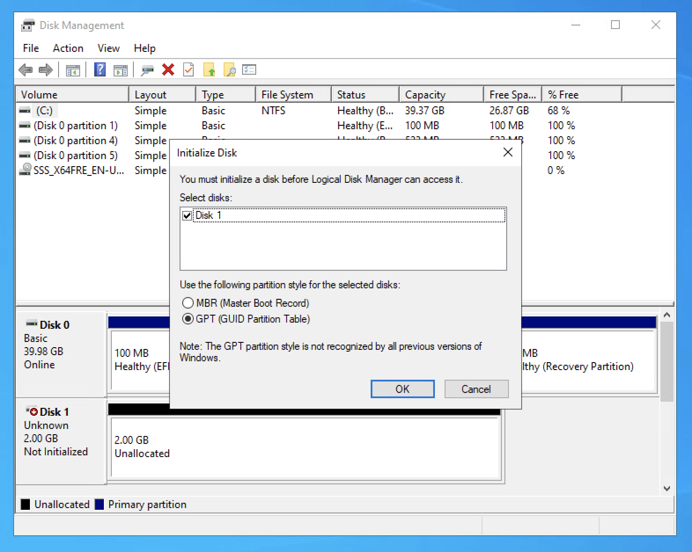
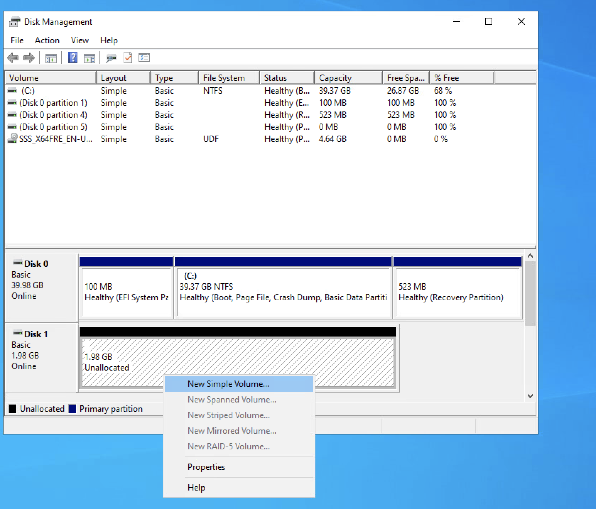
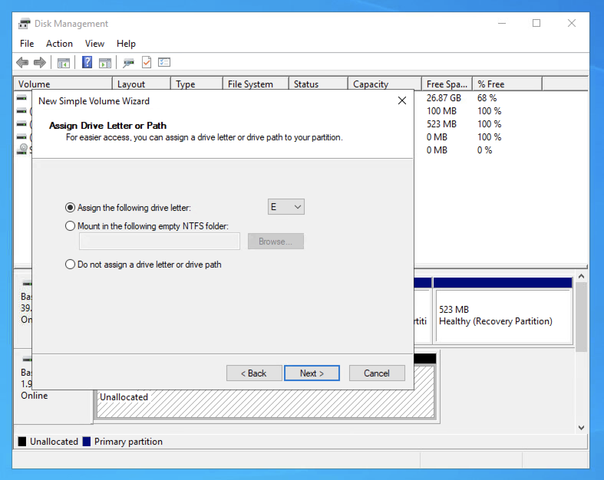
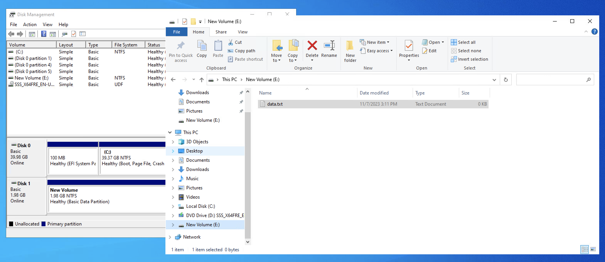

# Using the Data Disk Feature of VMware for Machine Catalog Creation

This page describes the use of VMware's Data Disk feature while creating a ProvScheme in Citrix Virtual Apps and Desktops (CVAD). The script [Create-ProvScheme-DataDisk-Example.ps1](./Create-ProvScheme-DataDisk-Example.ps1) shows an example usage of `New-ProvScheme` with the Data Disk Feature. Use [Add-ProvScheme.ps1](../Add%20ProvScheme/Add-ProvScheme.ps1) to use it with other parameters. VMware supported scenarios can be found [here](./README.md#3-vmware-data-disk-scenarios)


## 1. Understanding the Data Disk Feature

VMware now supports provisioning Data Disk in VMware using Master Image. This feature treats the 2nd disk attached to the MasterImageVM/Snapshot as the DataDisk. The DataDisk can be used for event logs, security traces, application data, etc.

### 1.1 Setting up DataDisk in VMware via MasterImageVM
DataDisk is supported with both MachineProfile and Non-Machine Profile ProvSchemes. You can use the same **-MasterImageVM** as the Data Disk source.

**Note:** This feature requires that your MasterImageVM contain **exactly ONE Data Disk**.

### 1.2 Steps to create a MasterImageVM with Data Disk
 1. Create a VM with two Hard Disks (1st will be the OS disk and 2nd will be the Data disk).
    1. Follow [this guide](https://docs.vmware.com/en/VMware-vSphere/8.0/vsphere-vm-administration/GUID-79116E5D-22B3-4E84-86DF-49A8D16E7AF2.html#GUID-F4917C61-3D24-4DB9-B347-B5722A84368C__GUID-918660A9-1E4F-4680-A35C-07DBF4A33258) to add a New Hard Disk (Data Disk) to an existing Virtual Machine.
 2. Login to the VM to initialize and format the disk, set the desired drive letter, add contents, etc.
    1. 
    2. 
    3. 
    4. 


## 2. Understanding the Concise Script using Data Disk Feature

To enable Data Disk, set the **DataDiskPersistence** with the value `'Persistent'` or `'NonPersistent'` in the **New-ProvScheme** cmdlet as shown below:

```powershell
New-ProvScheme `
  -ProvisioningSchemeName "MyMachineCatalog" `
  # Additional  Parameters... `
  -DataDiskPersistence 'Persistent'
```
OR
```powershell
New-ProvScheme `
  -ProvisioningSchemeName "MyMachineCatalog" `
  # Additional  Parameters... `
  -CleanOnBoot:$true
  -DataDiskPersistence 'NonPersistent'
```

**DataDiskPersistence** indicates whether the changes to the disk contents of the Prov-VMs will persist accross reboot.

When the value to this parameter is set to `'Persistent'` or `'NonPersistent'`, the data disk created will have `Dependent` or `Independent - Nonpersistent` Disk Mode in VMware respectively. Learn more about VMware Disk Modes [here](https://docs.vmware.com/en/VMware-vSphere/8.0/vsphere-vm-administration/GUID-E1D541D1-DF96-467A-89B7-E84F83B2563D.html).

## 3. VMware Data Disk Supported Scenarios:

The following 4 Data Disk scenarios are supported in VMware:
  1. OS Disk Persistent + Data Disk Persistent
  2. OS Disk Persistent + Data Disk Persistent with `-UseFullDiskCloneProvisioning`
  3. OS Disk Non-Persistent + Data Disk Persistent
  4. OS Disk Non-Persistent + Data Disk Non-Persistent

**NOTE:**
  * For 2nd scenario, the ProvVM's OS and Data disks will be Fully Cloned (See the [Full Clone Feature](../Full%20Clone/)), whereas for other scenarios, delta disks will be created from the base/mastered OS and Data disks.
  * For 3rd and 4th scenario, `-CleanOnBoot` must be given as the OS Disk is Non-Persistent and so `-UseFullDiskCloneProvisioning` is NA
  * To create a Non-Persistent Data Disk, the OS Disk must also be Non-Persistent i.e. `-CleanOnBoot` is set (4th scenario)
  * Once set, `DataDiskPersistence`, value is immutable. However, one can run `Publish-ProvMasterVMImage` cmd (See [Update-MasterImage](../Update%20Master%20Image/README.md))to update the source of the OS and Data disk.
    * After running the `Publish-ProvMasterVMImage` cmd,
	  * The new VMs will be created with the updated OS and Data Disks.
	  * The existing VMs' Non-Persistent disks will be updated on the next power cycle from Citrix Studio.
	  * The existing VMs' Persistent disks will not be updated on the next power cycle from Citrix Studio.

Use [Add-ProvScheme.ps1](../Add%20ProvScheme/Add-ProvScheme.ps1) to use it with other parameters and features like Write-Back Cache.

## 3. Example Full Scripts Utilizing Data Disk.

1. [Creation of a Machine Catalog with Data Disk](../../SampleAdminScenarios/Add%20Machine%20Catalog/README.md#6-specialized-scenario---using-data-disk)


