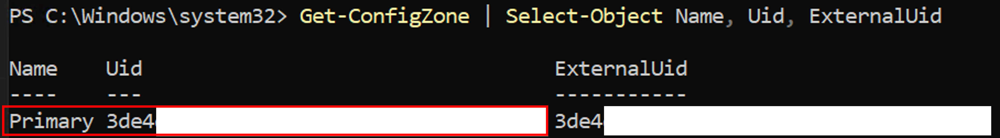
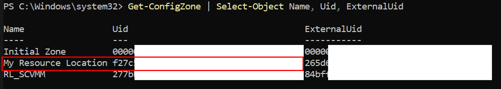
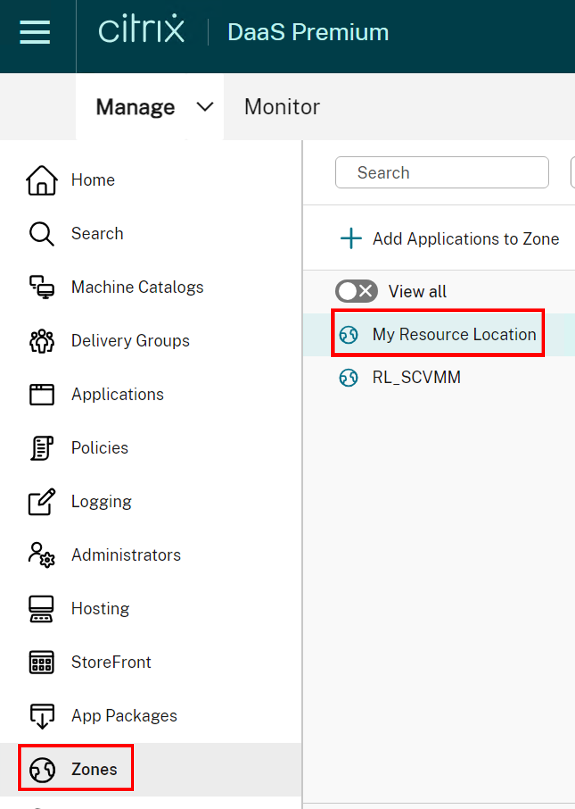

# Citrix Virtual Apps and Desktops PowerShell Cmdlets for VMware

This guide supports administrators in developing customized scripts for Citrix Virtual Apps and Desktops (CVAD), focusing on PowerShell cmdlets specific to **VMware** and its unique features.


## 1. Documentation Structure

The content is organized into six key sections, each targeting a specific domain:

* **Hosting Connection**
* **Hosting Unit**
* **Identity** 
* **ProvScheme** 
* **ProvVM**

Each section offers basic starter scripts for high-level CVAD operations, along with concise, **feature-focused cmdlets and descriptions** tailored for VMware. For instance, ``New-ProvScheme`` is detailed for its role in enabling Full/Fast Clone capabilities.

* **SampleAdminScenarios**

The folder above provides **comprehensive cmdlet sets** for executing common MCS administrator operations with practical examples, such as a set of end-to-end cmdlets for creating a Machine Catalog.


## 2. VMware Features
   
Below is a list of **VMware-Specific Features** covered in this documentation:

* Provisioning Schemes Features
    * [Utilize **Write-Back Cache**](./ProvScheme/Write-Back%20Cache/)
    * [Utilize **Full Clone** or **Fast Clone**](./ProvScheme/Full%20Clone/)
    * [Utilize **Data Disk**](./ProvScheme/Data%20Disk/)
    * [Update **Folder Id**](./ProvScheme/Folder%20ID/)
    


## 3. Comprehensive List of High-Level CVAD Operations.

The list below outlines the high-level CVAD operations for VMware that each section covers:

* [Operation for Managing **Hosting Connections**](./Hosting%20Connection/)
    * [Add a Hosting Connection](./Hosting%20Connection/Add%20Hosting%20Connection/)
    * [Add Scope](./Hosting%20Connection/Add%20Scope/)
    * [Remove a Hosting Connection](./Hosting%20Connection/Remove%20Hosting%20Connection/)
    * [Remove Scope](./Hosting%20Connection/Remove%20Scope/)
    * [Update Password](./Hosting%20Connection/Update%20Password/)

* [Operation for Managing **Hosting Units**](./Hosting%20Unit/)
    * [Add a Hosting Unit](./Hosting%20Unit/Add%20Hosting%20Unit/)
    * [Add a Storage](./Hosting%20Unit/Add%20Storage/)
    * [Remove a Hosting Unit](./Hosting%20Unit/Remove%20Hosting%20Unit/)
    * [Remove a Storage ](./Hosting%20Unit/Remove%20Storage/)
    * [Supersede a Storage](./Hosting%20Unit/Supersede%20Storage/)
    * [Add/Remove Networks](./Hosting%20Unit/Update%20Network/)
    
* [Operation for Managing **Provioning Scheme**](./ProvScheme/)
    * [Add a Provioning Scheme](./ProvScheme/Add%20ProvScheme/)
    * [Remove a Provioning Scheme](./ProvScheme/Remove%20ProvScheme/)
    * [Rename a Provioning Scheme](./ProvScheme/Rename%20ProvScheme/)
    * [Update the NetworkMapping of a Provioning Scheme](./ProvScheme/Update%20NetworkMapping/)
    * [Update the Master Image](./ProvScheme/Update%20Master%20Image/)
    * [Rollback the Master Image](./ProvScheme/RollBack%20Master%20Image/)
    * [Get the Details of a Provisioning Scheme](./ProvScheme/Get%20ProvScheme%20Details/)
    
* [Operation for Managing **Provisioning VMs**](./ProvVm/)
    * [Add Provisining VMs](./ProvVm/Add%20ProvVM/)
    * [Remove Provisining VMs](./ProvVm/Remove%20ProvVM/)
    * [Power Action, e.g., Power On, Power Off, etc](./ProvVm/Power%20Action/)
    * [Set Maintenance Mode](./ProvVm/Set%20Maintenance%20Mode/)
    * [Get the Details of Provisioning VMs](./ProvVm/Get%20ProvVM%20Detail/)
    
* [Operation for Managing **Identities**](./Identity/)
    * [Add an Identity Pool](./Identity/Add%20IdentityPool/)
    * [Add AD Accounts](./Identity/Add%20ADAccount/)
    * [Remove an Identity Pool](./Identity/Remove%20IdentityPool/)
    * [Remove AD Accounts](./Identity/Remove%20ADAccount/)
    * [Get the Detail of an Identity Pool](./Identity/Get%20IdentityPool%20Details/)
    * [Get the Detail of ADAccounts](./Identity/Get%20ADAccounts%20Details/)

* [**SampleAdminScenarios**](./SampleAdminScenarios/)
    * [Add a Machine Catalog](./SampleAdminScenarios/Add%20Machine%20Catalog/)
        * Special Scenarios using VMware Supported Features
            * [Specialized Scenario - Using Full Clone](./SampleAdminScenarios/Add%20Machine%20Catalog/README.md#4-specialized-scenario---using-full-clone)
            * [Specialized Scenario - Using Write-Back Cache](./SampleAdminScenarios/Add%20Machine%20Catalog/README.md#5-specialized-scenario---using-Write-Back-Cache)
            * [Specialized Scenario - Using Data Disk](./SampleAdminScenarios/Add%20Machine%20Catalog/README.md#6-specialized-scenario---using-data-disk)
    * [Remove a Machine Catalog](./SampleAdminScenarios/Remove%20Machine%20Catalog/)
    

## 4. Prerequisites

The scripts for VMware require prerequisites, as listed below.

* AdminAddress

    The AdminAddress signifies the Domain Controller's (DDC) address. Scripts intended to run in an On-Premises environment but not on the DDC machine need the AdminAddress as an input parameter

* ZoneUid

    Some scripts require ZoneUid, such as `New-AcctIdentityPool`. The ZoneUid can be obtained via `Get-ConfigZone` as below. It is worth noting that Uid needs to be used, not ExternalUid. In the case of multiple Zones are configured, please make sure that the appropriate zone is selected.

    ```powershell
    Get-ConfigZone | Select-Object Name, Uid, ExternalUid
    ```
    
    Below is an example of `Get-ConfigZone` that ran on an OnPrem environment. In the case of OnPrem environments, the Uid of Primary can be used.

    <div align="center">
     
    
    </div>

    Below is an example of `Get-ConfigZone` that ran on a Cloud env using Remote PowerShell. In the case of the Cloud environments, the proper Zone should be selected. In this example, the Cloud Connectors for XenServer are installed in the zone named "My Resource Location". The Uid for "My Resource Location" can be used.

    <div align="center">
     
    </div>

    To check the list of the zone names, the section "Zones" shows the list of available Zones as illustrated below. In this example, the zone name "My Resource Location" is matched with the `Get-ConfigZone` result for the Cloud env. The Uid can be used to run scripts.
    
    <div align="center">
     
    </div>